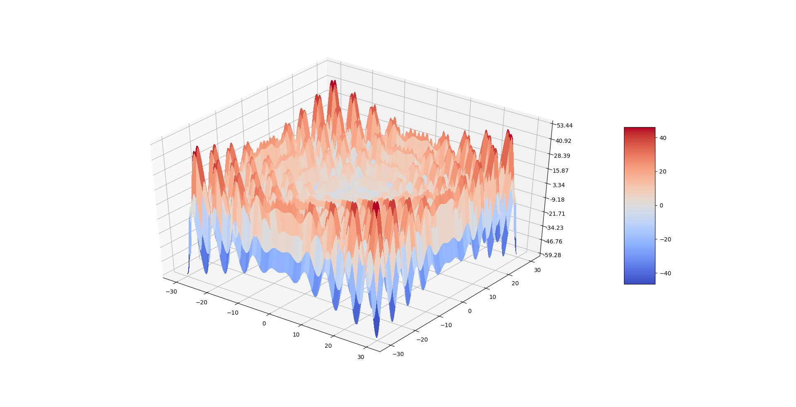
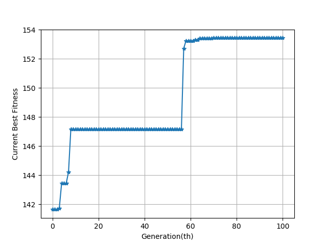

# EA Utility

A simple evolutionary algorithm utility.

## 1. Evolutionary Algorithm

From [Wikipedia - Evolutionary algorithm](https://en.wikipedia.org/wiki/Evolutionary_algorithm)

> In artificial intelligence, an evolutionary algorithm (EA) is a subset of evolutionary computation, a generic population-based metaheuristic optimization algorithm. An EA uses mechanisms inspired by biological evolution, such as reproduction, mutation, recombination, and selection. Candidate solutions to the optimization problem play the role of individuals in a population, and the fitness function determines the quality of the solutions (see also loss function). Evolution of the population then takes place after the repeated application of the above operators.
> 
> Evolutionary algorithms often perform well approximating solutions to all types of problems because they ideally do not make any assumption about the underlying fitness landscape. Techniques from evolutionary algorithms applied to the modeling of biological evolution are generally limited to explorations of microevolutionary processes and planning models based upon cellular processes. In most real applications of EAs, computational complexity is a prohibiting factor. In fact, this computational complexity is due to fitness function evaluation. Fitness approximation is one of the solutions to overcome this difficulty. However, seemingly simple EA can solve often complex problems; therefore, there may be no direct link between algorithm complexity and problem complexity.

## 2. Implementation

This code is a version of the standard GA which only contains mutation without crossover.

### Overall

``` 
Generate the initial population randomly
Evaluate the fitness of the individuals
while (gen < max_gen) do
    Select Top-k individuals as parents
    Generate new individual through mutation to replace the obsolete ones
    Evaluate the fitness of the individuals
    gen += 1
```

### Mutation

```
Randomly reverse the value of some bits
```

## 3. Usage & Example

Firstly, implement a <code>eval_func</code> as follow:

```python
def eval_func(individual):
    # The input individual is the encoding of the variables
    X = Decode(individual)
    fitness = Eval(X)
    # Other operations
    # fitness should be a value of comparable type
    return fitness
```

Then, get a instance of EA_Util with config

```python
ea_helper = EA_Util(
    name, # use for output the curve file
    pop_size, # size of population
    gen_size, # length of chromosome
    eval_fun, # evaluation function mentioned above
    max_gen, # max generation of evolution, default=100
    drop_set, # a set of bit index which value is 0 forever
    sp_set # a set of bit index which value is 1 forever
)
```

Finally, start the evolution and wait for its result.

```python
elite = ea_helper.evolution()
# evolution() will return the best index of individual with maximum fitness after evolution operation
print(ea_helper.population[elite])
print(ea_helper.fitness[elite])
```

### A simple numerical optimization example

The code is in <code>math_example_ea.py</code>.

#### Target

Find the maximum of the function: 

s.t. 

#### Graph of the function



#### Setting

In this sample, I set the gen_size to 32 which means 16 bits for each **x**. The helper totally evolutes for 100 generations.

For the encoding and decoding, each **x** is represented by a 16-bits vector, which means it has 65532(2^16) units. In this case, we define each unit with a value of 60/65532. Thus, the decoding operation can be described as follow:


where DEC() is the binary to decimal converter.

For the eval_func, we simplely set it as follow(+100 is to ensure that the value is always positive):


#### Convergence curves



After 100 epochs of evolution, EA finds a maximum of 53.435 while the real maximum is 53.442.